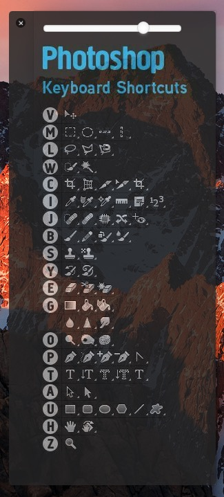

# ps-table
> [🖥 MacOS] Display Photoshop shortcut on desktop.

## Screen Shot

## Supported

* 🍎 darwin ✅
* 🏁 windows ❌
    * (Open an issue to remind me to build a windows version. 🤔)
* 🐧 linux ❌

## Download

* [Photoshop Table(39M)](https://github.com/lixinliang/ps-table/releases/download/v1.0.0/Photoshop.Table-darwin-x64.zip)

## License

MIT
